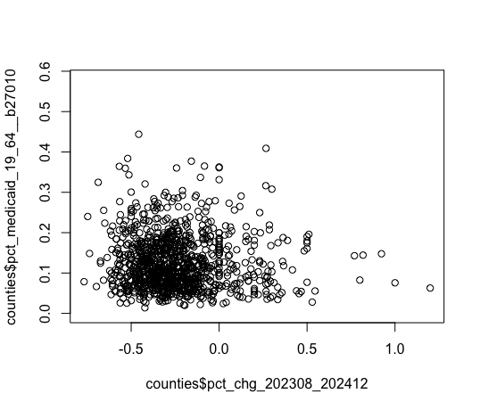

# us-overdoses
analyzing U.S. overdoses and related data over time at state and county levels
  
## data 
Following is a non-exhaustive listing of core sources for this database:
| name | source | state | county | years | path | notes |
|------|--------|-------|--------|-------|------|-------|
| Provisional Drug Overdose Death Counts | CDC | ✅ |  | 2015-2025 | data/cdc/VSRR_Provisional_Drug_Overdose_Death_Counts_20250917.csv |  |
| Provisional County-Level Drug Overdose Death Counts | CDC |  | ✅ | 2020-2024 | data/cdc/VSRR_Provisional_County- Level_Drug_Overdose_Death_Counts_20250716.csv |  |
| National Forensic Laboratory Information System | DEA | ✅ |  | 2015-2024 | data/nflis/NFLIS_fent_all.csv |  |

Other data sets included in the database include Census populations, American Community Survey data on income and medical insurance types, [KFF's Status of Medicaid Expansion Decisions](https://www.kff.org/medicaid/status-of-state-medicaid-expansion-decisions/), SAMHSA's National Survey on Drug Use and Health, CDC naloxone and buprenorphine dispensing and various other sources related to drug use in U.S. states and counties.


## usage
This database is designed to be accessible to users via Python, R, SQLite or spreadsheets. These quick-start instructions assume you have cloned the repository and unzipped od.db.zip.

### python
- create virtualenv in repo directory
- pip install requirements
- `python main.py --shell` and review prompt to interact with data via peewee orm or pandas

### R
- open RStudio  
- set your working directory, e.g.:   
`setwd('~/Documents/GitHub/us-overdoses')`  
then,  `source('db.R')`  to access tables:   
  - countys  
  - countymonths  
  - states
  - statemonths
 
e.g. make a scatterplot comparing pct change in overdose mortality (12-month ending 202308 vs 202412) against pct of adults (ages 19-64) on medicaid:  
```
plot(
  counties$pct_chg_202308_202412,
  counties$pct_medicaid_19_64__b27010)
```


### sqlite
- use your preferred SQLite manager to query `od.db`
- this repository also includes datasette, which requires python and installing requirements

### spreadsheets
- source files a
- re located in the data directory
- state- and county-level summaries will be added to the reports directory

## credits
When using this database, please credit the creators: The Guardian, Matt Kiefer and Hannah Harris Green.  
This resource was built with support from the USC Annenberg Center for Health Journalism Impact Fund for Reporting on Health Equity and Health Systems.
